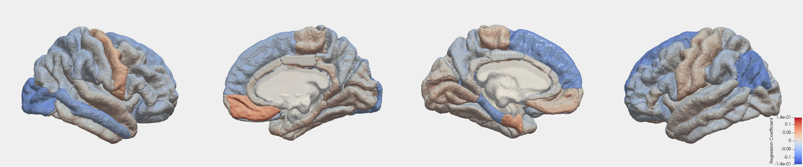
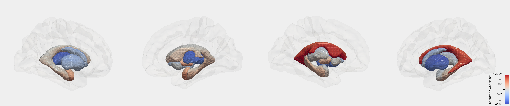
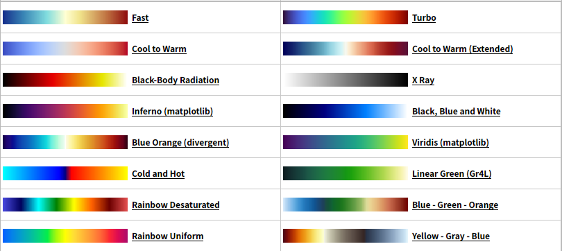
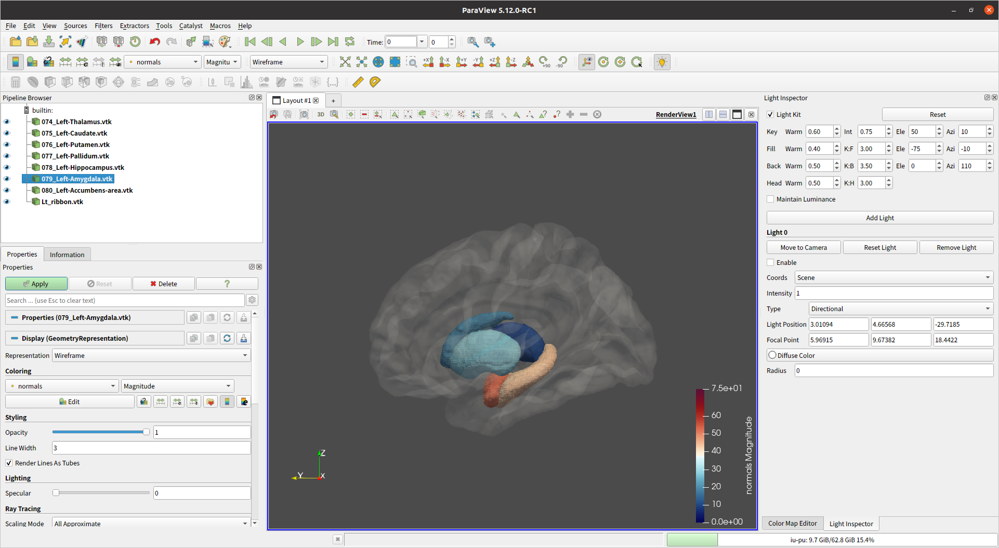
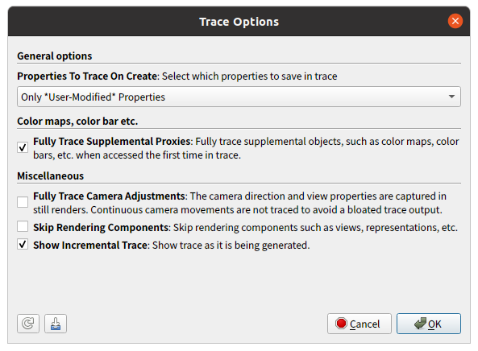

# BrainGraph with ParaView 

これはParaViewを利用して、脳の三次元グラフを生成するためのスクリプト集です。

 

以下のような3ステップで、上記のようなグラフを比較的簡単に作成できます。

**Step 1: 領域名と値を対にしたテキストファイル(tsv)をValueTableフォルダ内に置く。**

**Step 2: config.ini ファイルで tsvファイルの所在、値範囲、出力先等を指定する。**

**Step 3: generate_horizontally.sh または generate_verticall.sh を走らせる。**

このスクリプトの実行には、ParaViewが必要です。インストール方法は[下の方](#インストール方法)に書いてあります。

このスクリプト集で使われている方法を応用すれば、より細かな脳アトラスに対応した自由度の高い三次元脳グラフが作れるはずです。

-------- 

## ファイル・フォルダの説明と主要スクリプトファイルの使い方

### ValueTables/  

このフォルダ内には脳領域と値が対になって示されたtsvファイルを置く。脳領域はVtkFileTable.tsvで定義されている所定の名前で示す必要がある。脳領域の右隣に値を記述する。脳領域名と値の間にはタブを入れること。

### itksnap_workspaces/

開発用

### png/

最終画像出力先

### vtk/

自動生成されるvtkファイルが置かれる場所

###  *.ipynb

開発用

### VtkFileTable.tsv

tsvファイルとvtkファイルとの橋渡しをするファイル。

脳領域名とvtkファイルの対応関係が書かれている。

現時点で対応している全ての脳領域が書かれている。

### Infuse_Values_into_VTK_Files.py

Infuse_Values_into_VTK_Files.ipynb を py に変換したもの。

vtkに値を流し込み値を保持したVTKファイル達を生成するスクリプト

### PvpythonScript_Make_Figure.py

ParaViewの操作レコード機能を使いながら作ったスクリプト。

値を保持VTK達を読込みPNGを生成するスクリプト。

### MergePngHorizontally.py, MergePngVertically.py

MergePngHorizontally.ipynb, MergePngVertically.ipynb をpythonスクリプトへ変換したもの。

４つの画像（右大脳半球外側画像、右大脳半球内側画像、左大脳半球内側画像、左大脳半球外側画像）を水平または垂直方向に結合するためのスクリプト。

LabelTables

1. ValueTablesに領域

--------

### 対応しているLUTs

--------

### ParaViewについて
    
#### インストール方法
公式ページ（ https://www.paraview.org/ ）から、`ParaView-5.12.1-MPI-Linux-Python3.10-x86_64.tar.gz` を入手し、以下のような方法で配備する。

    cd ~/Downloads
    tar zxvf ParaView-5.12.1-MPI-Linux-Python3.10-x86_64.tar.gz
    sudo mv ParaView-5.12.1-MPI-Linux-Python3.10-x86_64 /opt
    # ParaView
    sudo ln -s /opt/ParaView-5.12.1-MPI-Linux-Python3.10-x86_64/bin/paraview /usr/local/bin
    # pvpython
    sudo ln -s /opt/ParaView-5.12.1-MPI-Linux-Python3.10-x86_64/bin/pvpython /usr/local/bin

`paraview` と打ってParaViewが起動されたり、`pvpython` と打ってPythonコンソールに入れればインストール成功である。

--------

## 思い立った経緯と開発ノート

Python等のスクリプト言語を使って、脳の深部構造を可視化する方法を調べているうちに、
ITK-SNAPがROI（Segmentation）のSurface MeshをVTKというファイル形式で出力できること、
そして、ParaViewというソフトウェアがVTKファイルを取り扱えて、
またParaViewがPythonスクリプトを使った操作レコーディング機能があるということを知り、
以下のような流れで三次元の脳のグラフを生成する方法を思い立ちました。

Step 1. ITK-SNAPでROIのSruface MeshをVTK形式で出力。
Step 2. 出力したVTKファイルを加工
Step 3. ParaViewでVTKファイルを読込み、描画操作をスクリプト化
Step 4. スクリプトを整え、自動でPNGファイルを出力させる。

Step 1 は、ITK-SNAP上で「Segmentation -> Export as Surface Mesh... -> Export a mesh for a single label -> [NEXT] -> Mesh file name -> [Finish]」でできる。Segmentation自体はfsaverageデータ内のNIfTIファイルを利用する。ITK-SNAPを利用してNIfTIを加工する。

Step 2 が必要な理由は、VTKファイルのData Fieldに任意の値を書き込むためである。
ITK-SNAPが出力する素の状態のVTKファイルには値０が格納されている。
ITK-SNAP上でどのようにしたら任意の値を格納したVTKファイルを生成できるのかよくわからないが、VTKファイルはアスキーファイルであるためのData FieldをPythonを使って書き換えるという加工を加える。

Step 3 は、ParaViewで「Tools -> Start Trace」でできる。何度もVTKファイルを読込み、描画操作の要点を掴み、それらをスクリプト化する。

Step 4ではpvpythonコマンドを使ってStep 3を経て得たpythonスクリプトを走らせる。

--------

## VTKファイルに値を流し込む

vtkフォーマット

VTK(Visualization Toolkit）は、３D可視化のためのオープンソースソフトウェアです。VTKは、C++クラスライブラリと、複数のインタプリタ型インターフェイスレイヤから構成されます。インターフェイスはTcl/Tk・Java・Pythonをサポートしています。

  * https://it-mayura.com/cae/paraview007/
  * https://ss1.xrea.com/penguinitis.g1.xrea.com/study/ParaView/VTK/VTK.html

    # vtk DataFile Version 4.0
    vtk output
    ASCII
    DATASET POLYDATA
    POINTS 824 float
    10 1.76415 -9 10 2 -8.74349 10.3522 2 -9 
    9 1.71547 -9 9 2 -8.59945 8.23782 2 -9 
    :
    TRIANGLE_STRIPS 321 2607
89 2 0 1 4 30 33 34 26 82 73 75 74 124 69 118 68 ...
    :
    POINT_DATA 824
    NORMALS normals float
    -0.269785 0.729497 -0.62853 -0.293051 0.707437 -0.64316 -0.383737 0.683781 -0.620637 
    :
    
ITK-SNAPを使うと、上記のような構造をしたテキストデータが得られる。
「NORMALS normals float」以下にVTKオブジェクトが保持する値が保持されている。
ITK-SNAPでは各トライアングルに平均0、値幅-1〜+1が割り振られたVTKオブジェクトが出力される。
そこでこのITK-SNAPが吐き出した素のVTKファイルを書き換えて任意の値を保持させ、それをParaViewで表示させることを考えた。

--------

### ITK-Snapについて

--------

### MRtrix3、FSL等

--------

## 作業の流れ

### ITK-SNAP上でROIを定義する

  #### Aparcファイルを使って領域ごとのNIfTIファイル生成.ipynb
  * MRtrix3コマンドやFSLコマンド等を使って、DKアトラス領域画像を領域毎にバラす。nii.gzとして出力。
  
  #### 手塗り

  ### nii.gz ⇒ vtk

* ITK Snap で ROIを開く。修正。
  * VTK形式のSurface Mesh Data として出力
    * Segmentation -> Export as Surface Mesh... -> Export a mesh for a single label -> [NEXT] -> Mesh file name -> [Finish]

### 各領域のvtkファイルに値を流し込む

  * 値を修正
 
#### ParaView上の操作をトレースして、pvpython用スクリプトを作る

  * ParaViewで表示
  * pvpython でコマンド化

iu@iu-pu:~/Dropbox/__JNFiles__/HowTo_52_BrainVisualization_with_VTK$ pvpython ./Control_ParaView.py 

Tools > Start Trace

  * ✓ Fully Trace Supplemental Procies
  * ✓ Show Incremantal Trace

がおすすめ。

Wireframe, Line Width 3, Render Lines As Tubes ON が良さそうだ。Lightを設定しなくても明るく表示される。

