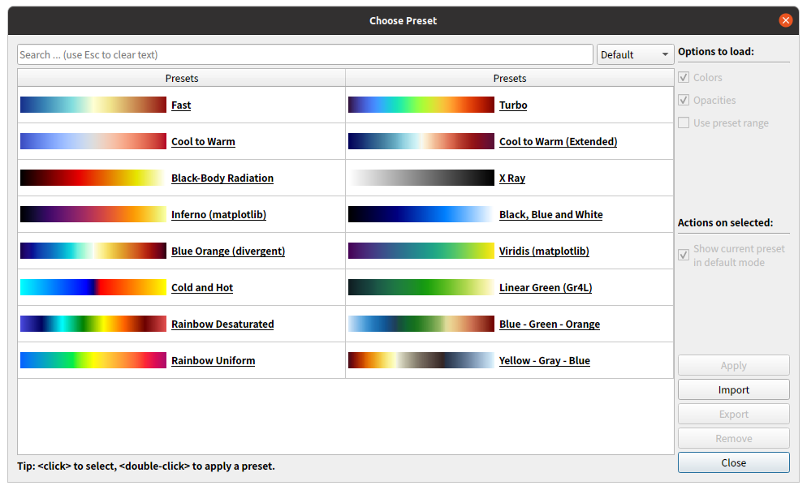

ParaViewを使った三次元脳グラフの生成方法

この方法を使えば、非常に自由度の高い三次元脳グラフが作れるはず。

## これはなにか？実現したいことの概要

Python等のスクリプト言語を使って、脳の深部構造を可視化する方法を調べているうちに、
ITK-SNAPがROI（Segmentation）のSurface MeshをVTKというファイル形式で出力できること、
そして、ParaViewというソフトウェアがVTKファイルを取り扱えて、
またParaViewがPythonスクリプトを使った操作レコーディング機能があるということを知り、
以下のような流れで三次元の脳のグラフを生成する方法を思い立ちました。

Step 1. ITK-SNAPでROIのSruface MeshをVTK形式で出力。
Step 2. 出力したVTKファイルを加工
Step 3. ParaViewでVTKファイルを読込み、描画操作をスクリプト化
Step 4. スクリプトを整え、自動でPNGファイルを出力させる。

Step 1 は、ITK-SNAP上で「Segmentation -> Export as Surface Mesh... -> Export a mesh for a single label -> [NEXT] -> Mesh file name -> [Finish]」でできる。Segmentation自体はfsaverageデータ内のNIfTIファイルを利用する。ITK-SNAPを利用してNIfTIを加工する。

Step 2 が必要な理由は、VTKファイルのData Fieldに任意の値を書き込むためである。
ITK-SNAPが出力する素の状態のVTKファイルには値０が格納されている。
ITK-SNAP上でどのようにしたら任意の値を格納したVTKファイルを生成できるのかよくわからないが、VTKファイルはアスキーファイルであるためのData FieldをPythonを使って書き換えるという加工を加える。

Step 3 は、ParaViewで「Tools -> Start Track」でできる。何度もVTKファイルを読込み、描画操作の要点を掴み、それらをスクリプト化する。

Step 4ではpvpythonコマンドを使ってStep 3を経て得たpythonスクリプトを走らせる。

-------- 

## ファイル・フォルダの説明と主要スクリプトファイルの使い方

  * ValueTables: 
  * 
  * Infuse_Values_into_VTK_Files.py: VTKに値を流し込み値を保持したVTKファイル達を生成するスクリプト
  * PvpythonScript_Make_Figure.py: 値を保持VTK達を読込みPNGを生成するスクリプト。
  * 

LabelTables

--------

## VTKファイルに値を流し込む

vtkフォーマット

VTK(Visualization Toolkit）は、３D可視化のためのオープンソースソフトウェアです。VTKは、C++クラスライブラリと、複数のインタプリタ型インターフェイスレイヤから構成されます。インターフェイスはTcl/Tk・Java・Pythonをサポートしています。

  * https://it-mayura.com/cae/paraview007/
  * https://ss1.xrea.com/penguinitis.g1.xrea.com/study/ParaView/VTK/VTK.html

    # vtk DataFile Version 4.0
    vtk output
    ASCII
    DATASET POLYDATA
    POINTS 824 float
    10 1.76415 -9 10 2 -8.74349 10.3522 2 -9 
    9 1.71547 -9 9 2 -8.59945 8.23782 2 -9 
    :
    TRIANGLE_STRIPS 321 2607
89 2 0 1 4 30 33 34 26 82 73 75 74 124 69 118 68 ...
    :
    POINT_DATA 824
    NORMALS normals float
    -0.269785 0.729497 -0.62853 -0.293051 0.707437 -0.64316 -0.383737 0.683781 -0.620637 
    :
    
ITK-SNAPを使うと、上記のような構造をしたテキストデータが得られる。
「NORMALS normals float」以下にVTKオブジェクトが保持する値が保持されている。
ITK-SNAPでは各トライアングルに平均0、値幅-1〜+1が割り振られたVTKオブジェクトが出力される。
そこでこのITK-SNAPが吐き出した素のVTKファイルを書き換えて任意の値を保持させ、それをParaViewで表示させることを考えた。

--------

### ITK-Snapについて

--------

### ParaViewについて
    
インストール方法
公式ページ（ https://www.paraview.org/ ）から、以下を入手する。

ParaView-5.12.0-RC1-MPI-Linux-Python3.10-x86_64.tar.gz
    cd ~/Downloads
    tar zxvf ParaView-5.12.0-RC1-MPI-Linux-Python3.10-x86_64.tar.gz
    sudo mv ParaView-5.12.0-RC1-MPI-Linux-Python3.10-x86_64 /opt
    # ParaView
    sudo ln -s /opt/ParaView-5.12.0-RC1-MPI-Linux-Python3.10-x86_64/bin/paraview /usr/local/bin
    # pvpython
    sudo ln -s /opt/ParaView-5.12.0-RC1-MPI-Linux-Python3.10-x86_64/bin/pvpython /usr/local/bin

### MRtrix3、FSL等

--------

## 作業の流れ

### ITK-SNAP上でROIを定義する

  #### Aparcファイルを使って領域ごとのNIfTIファイル生成.ipynb
  * MRtrix3コマンドやFSLコマンド等を使って、DKアトラス領域画像を領域毎にバラす。nii.gzとして出力。
  
  #### 手塗り

  ### nii.gz ⇒ vtk

* ITK Snap で ROIを開く。修正。
  * VTK形式のSurface Mesh Data として出力
    * Segmentation -> Export as Surface Mesh... -> Export a mesh for a single label -> [NEXT] -> Mesh file name -> [Finish]

### 各領域のvtkファイルに値を流し込む

  * 値を修正
 
#### ParaView上の操作をトレースして、pvpython用スクリプトを作る

  * ParaViewで表示
  * pvpython でコマンド化

iu@iu-pu:~/Dropbox/__JNFiles__/HowTo_52_BrainVisualization_with_VTK$ pvpython ./Control_ParaView.py 

Tools > Start Trace

✓ Fully Trace Supplemental Procies

✓ Show Incremantal Trace

がおすすめ。

Wireframe, Line Width 3, Render Lines As Tubes ON が良さそうだ。

