--------------------------

## 既存のnii.gzマスク画像をvtkファイルにする方法

rh.ribbon.nii などベースとなる画像をMain Imageとして開く

Segmentation > Opent Segmentation ... からターゲットとなるROIのnii.gzファイルを開く。

コツここでファイル名をクリップボードに入れておくと良い。

左下のUpdateボタンを押す。

  
Segmentation > Export as Surface Mesh ...
  Export a mesh for a single label
  File Format: VTK PolyData File
  

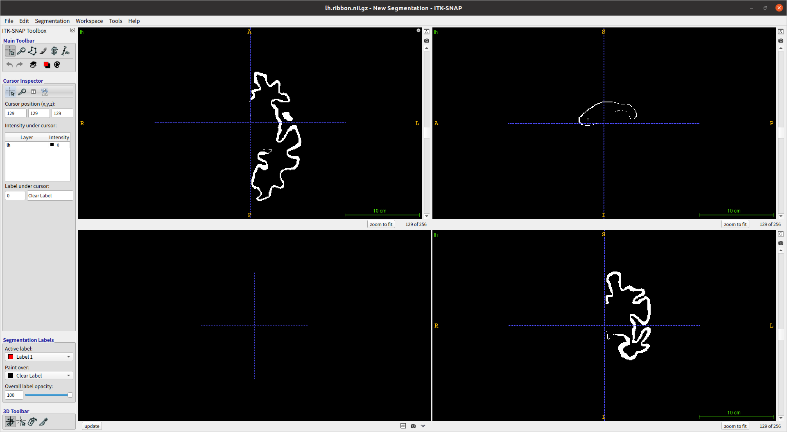
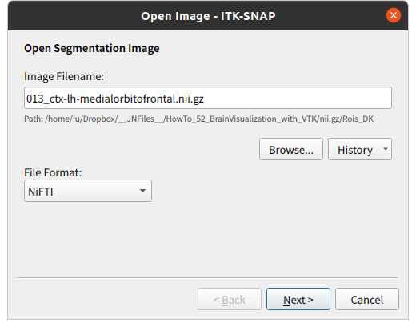
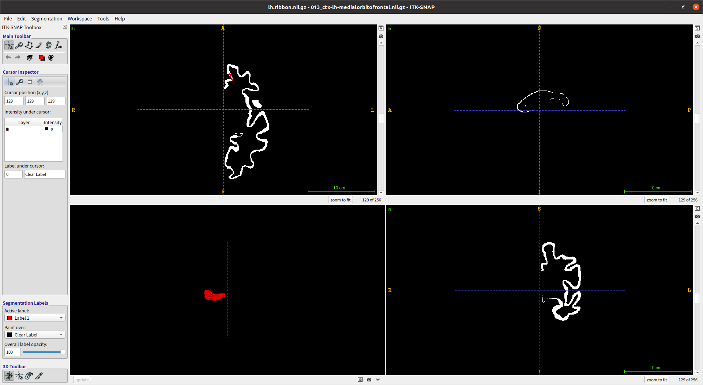
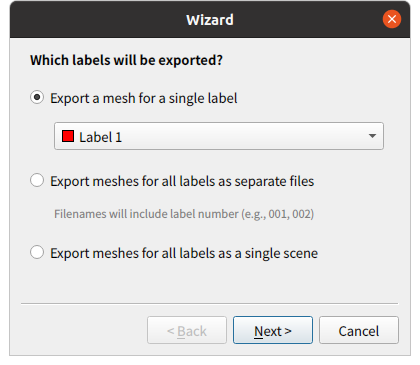
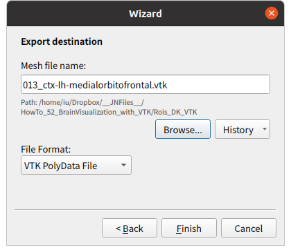

---------------------

## 自らROIを塗ってvtkファイルを生成する方法

### 開く

Ctrl + G

コツ：ここでファイル名をクリップボードに入れておくと良い。001_ctx-lh-bankssts.nii.gz

### Segment 3D モードに入る。

Snakeボタンを押すと、赤や黄色の点線で囲まれた枠が出るので、標的ROI全体が入るようにサイズ、位置を調整。

Segment 3Dボタンを押し、Segment 3Dモードに入る。

### Segment 3D Step 1/3 

Presegmentation mode を Thresholding にして、Threshold modeを真ん中（Lowerのみ指定モード）にして、Nextを押す。値は0.3333とかで良い。

もしくは

Presegmentation mode を Clustering にして、Foreground clusterを２

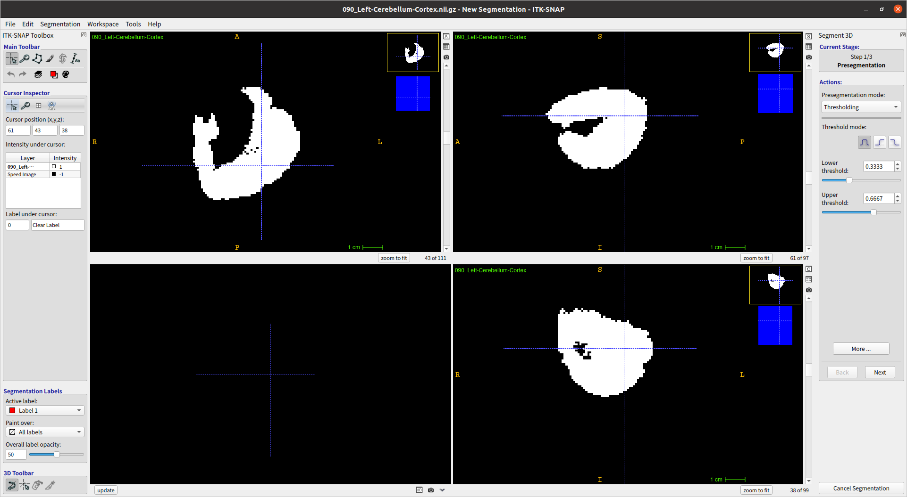

コツ：右側に青いPreview Imageが表示される。これがSpeed Image Layer。Speed Image Layerにおいて標的ROIが白抜きになるように域値を調整する。

### Segment 3D Step 2/3

Add Bubble at Cursorボタン等を使って、自動でLabel塗りをする際のスタートポイントを指定する。

指定し終わったら Nextを押す。

注意：このときEvolving CotourというLayerが不可視状態になっていることがある。そんなときは、左サイドエリアにある Cursor Inspector / Intensity under cursor: の「Display as Overlay」 は OFF「Envolving Contour」を右クリックして、Opacity を 変更してみる。（Image Layer Inspector のアイコンをクリックして表れるウィンドウでも操作できる。）またBubbleサイズは２未満だと上手く行かない。

### Segment 3D Step 3/3

Step 3/3 に入ると「Evolving Contour」というLayerができる。 

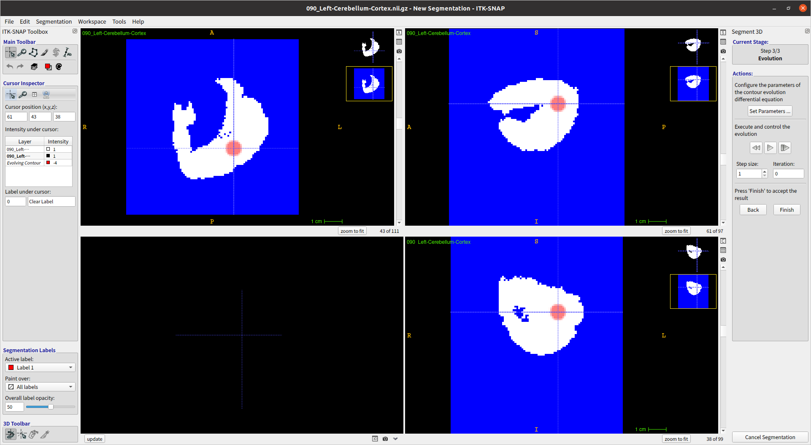

Execute and control the evolution の 再生ボタンを押す。自動コンツーリングを適当なところで止める。

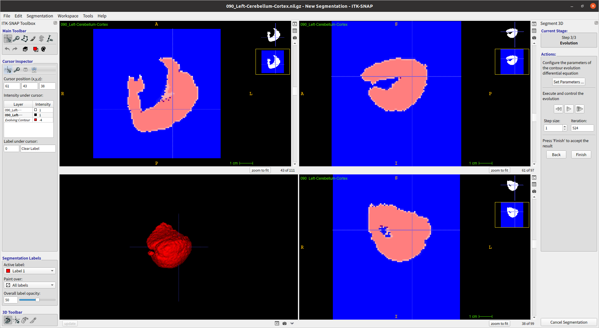

3D表示パネル下のupdateボタンを押すと3次元表示される。Finishボタンを押す。すると "Label 1" の Segmentation が生成される。

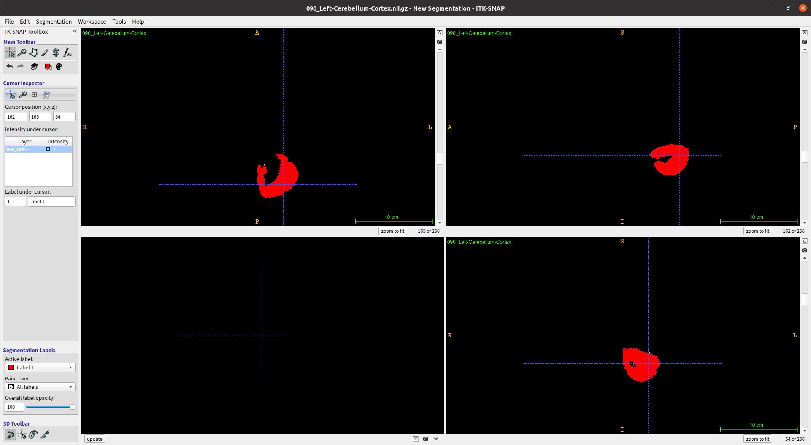

### 塗り残しを修正

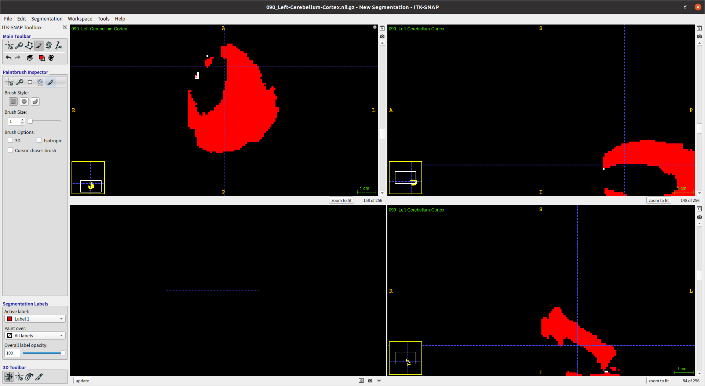

### 作業環境の保存とSegmentationのExport

Segmentation > Save Segmatation Image ...
  nii.gz/Segmentations に保存

Workspace > Save Workspace As ...
  itksnap/Workspaces に保存
  
Segmentation > Export as Surface Mesh ...
  Export a mesh for a single label
  File Format: VTK PolyData File

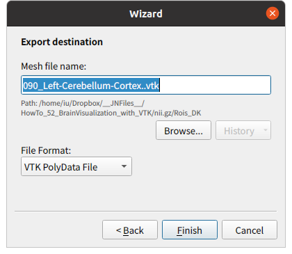
  

### 閉じる

Ctrl + W

